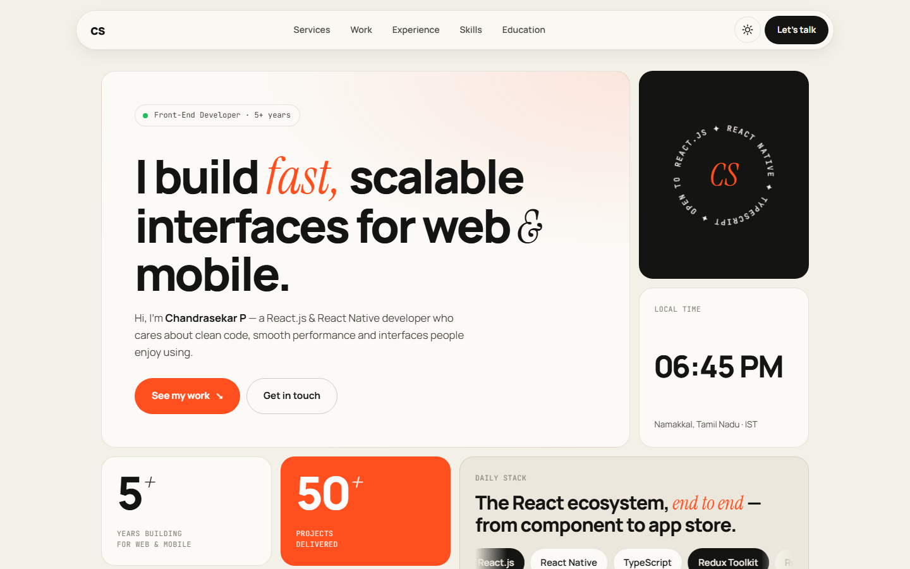

# Chandrasekar P — Portfolio

Personal portfolio of **Chandrasekar P**, a Front-End Developer with 5+ years of experience building responsive, scalable web and mobile applications with React.js, React Native and TypeScript.

**Live site → [chandrasekar1996.github.io/portfolio](https://chandrasekar1996.github.io/portfolio/)**

<picture>
  <source media="(prefers-color-scheme: dark)" srcset="images/readme/preview-dark.png">
  
</picture>

## Highlights

- **Bento-grid hero**: intro, a rotating badge, a live Namakkal clock (IST), stats, and a scrolling "daily stack" of chips
- **Light and dark themes**: follows the system setting by default, with a toggle that remembers the visitor's choice
- **Illustrated project cards**: the mockups are drawn with CSS and inline SVG, with no image files
- **Accordion experience timeline** built on native `<details>` elements
- **Contact form without a backend**: it opens the visitor's email app with the message already filled in, so it works on static hosting
- **Responsive and accessible**: mobile menu, keyboard focus styles, a skip link, and `prefers-reduced-motion` support
- **No build step**: plain HTML, CSS and vanilla JavaScript, with no frameworks or dependencies

## Sections

Hero · Services · Selected Work · Experience · Skills · Education & Certifications · Contact

## Tech

| | |
|---|---|
| Markup | Semantic HTML5 |
| Styling | CSS custom properties, Grid, Flexbox, `color-mix()` |
| Scripting | Vanilla JS: IntersectionObserver, `Intl.DateTimeFormat`, Clipboard API |
| Fonts | Manrope, Instrument Serif, JetBrains Mono (Google Fonts) |
| Hosting | GitHub Pages |

## Run locally

No install needed. Open `index.html` in a browser, or serve the folder:

```bash
git clone https://github.com/chandrasekar1996/portfolio.git
cd portfolio
python -m http.server 8000
# then visit http://localhost:8000
```

## Project structure

```
index.html        All page content
css/site.css      Styles and light/dark theme tokens
js/site.js        Theme toggle, menu, clock, scroll reveal, contact form
images/           Favicons and README screenshots
```

## Contact

- Email: [chandrasekar1996@gmail.com](mailto:chandrasekar1996@gmail.com)
- LinkedIn: [chandrasekar-p](https://www.linkedin.com/in/chandrasekar-p-6a3136a1/)
